 

---

## Frontier-class AI, on hardware you physically control

Every AI platform in the market asks you to accept one thing: that your data leaves your
building. For most organizations that trade is acceptable. For defense contractors under
CMMC 2.0, hospitals holding genomic records, banks running proprietary models, and any
enterprise operating under PIPL or a cross-border transfer regime, it is not a trade they
are permitted to make.

**IronGap builds for the organizations that cannot say yes.**

Vault-OS runs open-weight large language models entirely on customer hardware,
cryptographically bound to it, with no network egress path to exploit. Not a private cloud.
Not a VPC. No route out of the perimeter at all — because a path that exists is a path that
can be attacked, and the only guarantee that survives a real adversary is one enforced by
architecture rather than policy.

---

## Vault-OS

<table>
<tr>
<td width="33%" valign="top">

### Isolation
TPM 2.0 hardware tethering through Platform Configuration Registers. Zero-Docker: PostgreSQL
and pgvector run natively, so there is no container runtime to escape. Zero telemetry, zero
outbound calls.

</td>
<td width="33%" valign="top">

### Inference
A polymorphic engine layer over vLLM, Ollama and TensorRT-LLM, with multi-node GPU
clustering. Open weights only — Llama 3, Mixtral, Qwen — plus vision, embeddings and
speech recognition.

</td>
<td width="33%" valign="top">

### Retrieval
Hybrid RAG on pgvector with HNSW indexing, automated entity and relationship extraction
into a knowledge graph, and an adversarial critic pass before output is accepted.

</td>
</tr>
<tr>
<td valign="top">

### Agency
A DAG workflow runtime with Kahn topological sorting, 33 node types, 33 contextual tools and
sandboxed ReAct agents — autonomy inside a perimeter that cannot reach outside itself.

</td>
<td valign="top">

### Custody
A 9-tier clearance matrix, multi-party encrypted messaging, server-enforced auto-delete, and
an encrypted enclave under a master password we do not hold a copy of.

</td>
<td valign="top">

### Accountability
SHA-256 hash-chained, RSA-signed tamper-evident audit logs. A NIST SP 800-88 burn protocol
for cryptographic self-termination.

</td>
</tr>
</table>

---

## Compliance as an architectural premise

Most vendors treat compliance as a control layer added after the product works. We treat it
as the constraint the product is built around — which means several obligations are satisfied
structurally rather than procedurally.

| Regime | How isolation addresses it |
|---|---|
| **PIPL / CSL / DSL** | Cross-border transfer violations are eliminated architecturally — there is no transfer |
| **CMMC 2.0 Level 3** | APT mitigation for the Defense Industrial Base; CUI never traverses a network boundary |
| **GDPR / CCPA** | No third-party subprocessors, therefore no subprocessor liability and no DPA to negotiate |
| **HIPAA** | Suitable for patient records and genomic analysis without a cloud BAA |

---

## Deployment

**Bring your own hardware** — a software license for servers you procure and control.
**Turnkey appliance** — we source, assemble and ship a pre-configured GPU node, sealed.

Vault-OS ships on Windows today, with Linux and macOS in development. The Vault-Ecosystem
client is available for Windows, with Linux, macOS, Android and iOS in progress.

---

## A note on this organization

Vault-OS is closed-source, and will stay that way. Publishing the implementation of an
air-gapped security appliance would hand an adversary the threat model, and our customers
are not in a position to absorb that risk on our behalf.

What we will publish here is everything that can be verified without it: architecture
documentation, integration tooling, client SDKs, and public interfaces. If you are
evaluating Vault-OS and need to see more than a repository can show you, the architecture
whitepaper is public and we run technical audits under NDA — [request one](https://www.iron-gap.com/contact?topic=Secure%20Audit).

---

**IronGap Technologies** · Istanbul, Türkiye · An independent, founder-led company

[iron-gap.com](https://www.iron-gap.com) · [Whitepaper](https://www.iron-gap.com/whitepaper) · [Pricing](https://www.iron-gap.com/pricing) · [info@iron-gap.com](mailto:info@iron-gap.com)

 

<i>Absolute data sovereignty requires absolute isolation.</i>

