 

 

`v1.0.9.1` · Windows shipping · Linux & macOS in development · **SYSTEM_SEALED**

---

## Who this is for

You have a compliance officer who has already told you no.

Perhaps you hold Controlled Unclassified Information and your DIB contract requires CMMC 2.0
Level 3. Perhaps you are a hospital sitting on genomic data and your counsel will not sign a
cloud BAA. Perhaps you are a fund whose alpha is the model itself, and sending it to an
inference provider is the one thing you cannot do. Perhaps you operate under PIPL, where the
question is not whether the transfer is encrypted but whether it is lawful at all.

In each case the blocker is structural, and no amount of encryption-in-transit, no VPC, no
private endpoint and no enterprise tier resolves it. The data still leaves.

**Vault-OS is what you deploy when the answer has to be that it doesn't.**

---

## What changes when the path doesn't exist

Security is usually a matter of defending routes. Remove the routes and most of the defence
becomes unnecessary — along with most of the ways it can be misconfigured.

---

## Architecture

### The boot chain is fail-deadly

The license is not a file that can be copied. It is bound to Platform Configuration
Registers in the machine's TPM, with fallback to motherboard UUID, MAC address and CPU
serial. If the measurement does not match, the decryption keys are never derived and the
enclave stays sealed — the disk holds ciphertext and nothing else. Failure is not a locked
UI over readable data; it is data that cannot be read.

### Retrieval is grounded or refused

Hybrid RAG on natively bundled pgvector with HNSW indexing over 768-dimensional embeddings,
with a +0.3 similarity boost for recognised entities. Automated entity and relationship
extraction builds a knowledge graph beneath the index. A multi-agent critic performs an
adversarial second pass, and an answer that cannot be grounded in retrieved source is
refused rather than produced.

### Every write is on the record

SHA-256 hash-chained and RSA-signed. Altering a historical entry invalidates every entry
after it, which is the property an auditor needs and the property a log file does not have.

---

## Capabilities

<table>
<tr><td width="50%" valign="top">

### Isolation
Zero-Docker native services. PostgreSQL and pgvector run as Windows services, not
containers — no runtime to escape, no orchestrator to misconfigure. Zero telemetry, zero
outbound calls, draconian CSP (`default-src 'self'`).

</td><td width="50%" valign="top">

### Inference
Polymorphic engine layer across vLLM, Ollama and TensorRT-LLM, with multi-node GPU
clustering for distributed inference. Bundled multimodal chat, vision, embeddings and
Whisper speech recognition. Open weights: Llama 3, Mixtral, Qwen.

</td></tr>
<tr><td width="50%" valign="top">

### Autonomy
A DAG workflow runtime with Kahn topological sorting across 33 node types, 33 contextual
assistant tools, and sandboxed ReAct agents — full agentic execution inside a perimeter
with no route out of itself.

</td><td width="50%" valign="top">

### Access
A 9-tier clearance matrix from Chairman down to Tier 0. Multi-party encrypted messaging with
group-local roles, per-member restrictions, slow mode and server-enforced auto-delete.

</td></tr>
<tr><td width="50%" valign="top">

### Custody
A BitLocker-encrypted enclave that never receives a drive letter, mounted to an
access-controlled directory under a master password IronGap holds no copy of. Memory is
wiped on session close.

</td><td width="50%" valign="top">

### Termination
A NIST SP 800-88 burn protocol for cryptographic self-termination and absolute erasure.
Three-channel certificate verification defeats trust-on-first-use. Installation is a
resumable ~22GB unpack that survives power loss.

</td></tr>
</table>

---

## Compliance as an architectural premise

Most vendors add compliance as a control layer once the product works. We treat it as the
constraint the product is built around, which means several obligations are satisfied
structurally rather than procedurally.

| Regime | How isolation addresses it |
|---|---|
| **PIPL / CSL / DSL** | Cross-border transfer violations eliminated architecturally — there is no transfer to authorise |
| **CMMC 2.0 Level 3** | APT mitigation for the Defense Industrial Base; CUI never traverses a network boundary |
| **GDPR / CCPA** | No third-party subprocessors, therefore no subprocessor liability and no DPA to negotiate |
| **HIPAA** | Patient records and genomic analysis without a cloud BAA |

---

## Deployment

| | **Bring your own hardware** | **Turnkey appliance** |
|---|---|---|
| Hardware | You procure and control it | We source, assemble and ship it sealed |
| Delivered as | Software license | Pre-configured GPU node |
| Suited to | Existing datacentre capacity | Fastest path to an operational enclave |

**Vault-OS** — Windows available now; Linux and macOS in development.
**Vault-Ecosystem** — Windows available; Linux, macOS, Android and iOS in progress.

---

## Specification

| | |
|---|---|
| Clearance tiers | 9 |
| DAG node types | 33 |
| Assistant tools | 33 |
| Local inference engines | 3 — vLLM, Ollama, TensorRT-LLM |
| **Network egress paths** | **0** |
| Vector dimensions | 768 (pgvector, HNSW) |
| Enclave unpack | ~22GB, resumable |
| Audit ledger | SHA-256 chained, RSA signed |
| Erasure standard | NIST SP 800-88 |

---

## Why this organization has few public repositories

Vault-OS is closed-source and will remain so. Publishing the implementation of an air-gapped
security appliance hands an adversary the threat model, and our customers are not positioned
to absorb that risk on our behalf.

What we publish here is what can be verified without it: architecture documentation,
integration tooling, client SDKs and public interfaces. The architecture whitepaper is
public, and we run technical audits under NDA for organisations evaluating deployment —
[request one](https://www.iron-gap.com/contact?topic=Secure%20Audit).

We would rather be judged on a document you can interrogate than on a repository that proves
nothing about what runs on the appliance.

---

**IronGap Technologies** · Istanbul, Türkiye · An independent, founder-led company

[iron-gap.com](https://www.iron-gap.com) · [Whitepaper](https://www.iron-gap.com/whitepaper) · [Pricing](https://www.iron-gap.com/pricing) · [Comparison](https://www.iron-gap.com/comparison) · [info@iron-gap.com](mailto:info@iron-gap.com)

 

<i>We cannot recover your master password. That is the guarantee, and it cuts both ways.</i>

